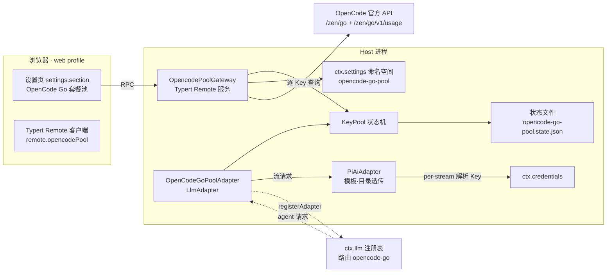

# dsh-opencode-go-pool 详细设计文档

> 版本 v0.1 草案 · 2026-08-16
> 目标：为 DeepSeek Harness（DSH）提供 OpenCode Go 套餐的**多 Key 池自动切换**与**套餐余额管理卡片**。
> 本文档中所有 DSH 机制均已对照源码验证（源码位于 `/Users/whitelonng/code/deepseek-harness`，运行版为 DSHCode 0.1.0-rc.7）。

---

## 1. 背景与目标

OpenCode Go 套餐每个账号有固定额度（5 小时滚动窗口 + 每周 + 每月上限）。DSH 官方供应商列表中的 OpenCode Go（路由 id `opencode-go`，由 `dsh-llm-pi-ai` 插件基于 pi-ai 目录提供）每个供应商档案只能配置**一个** `apiKeyEnv` 凭据引用。额度耗尽后用户必须手动更换 Key。

### 目标（v1）

| # | 能力 | 验收要点 |
|---|---|---|
| G1 | 多 Key 池自动切换 | 当前 Key 额度耗尽时，同一请求内静默切换到下一 Key，对话零感知 |
| G2 | 套餐管理卡片 | 设置侧边栏新增页面，逐 Key 显示 5h 滚动/每周/每月 已用%·剩余%·重置时间，与官网一致 |
| G3 | 运行态管理 | 卡片可停用/启用 Key、手动指定活动 Key、查看失效/耗尽状态 |
| G4 | 无缝接管 | 接管 `opencode-go` 路由后，历史会话与模型选择器不变，对话继续 |

### 非目标（v1 不做）

- 代理/中转服务、用量预测、跨套餐聚合
- Key 明文入库（明文只走 DSH 凭据 seam）
- 修改 DSH 核心代码或 api-proxy 白名单

---

## 2. 调研结论（已验证事实）

| # | 事实 | 出处 |
|---|---|---|
| F1 | 插件可通过 `ctx.llm.registerAdapter(providers, adapter)` 注册/接管供应商路由；路由归属是**排他**的，冲突时注册失败 | `packages/llm/llm` README |
| F2 | 传输层有供应商中立的额度耗尽错误码 `QUOTA_EXCEEDED_CODE`，pi-ai 适配器已把额度类错误归类为该码；429 额度文案 → QUOTA_EXCEEDED，普通 429 → RATE_LIMIT | `packages/llm/llm-pi-ai/src/stream.ts:41-42` |
| F3 | `PiAiAdapter` 及其 `PiAiAdapterOptions`、`ResolvedPiAiProviderProfile` 从 `@deepseek-ai/dsh-llm-pi-ai` 包根导出；`resolveApiKey` 在**每次 stream 调用**时解析一次——轮换 Key 只需改变解析结果 | `packages/llm/llm-pi-ai/src/index.ts`、`src/adapter.ts` |
| F4 | 适配器可覆写 `providerRetryPolicy()` 提供路由级重试策略（可改预算、可重试码、退避）；`llm-retry` 在 `agent/request-error` 水线按此策略开新轮重试，模型侧不可见 | `packages/llm/llm`、`packages/llm/llm-retry` README |
| F5 | 拓扑提交（注册/注销/替换）后发出 `llm/adapters-updated` 事件 | `packages/llm/llm` README |
| F6 | pi-ai 目录自带 `opencode-go` 供应商（“OpenCode Zen Go”）：三种协议 anthropic-messages / openai-completions / openai-responses，端点 `https://opencode.ai/zen/go`（completions 模型为 `/v1` 后缀） | pi-ai dist `providers/opencode-go.js`、`data/opencode-go.json` |
| F7 | 官方用量接口：`GET https://opencode.ai/zen/go/v1/usage`，`Authorization: Bearer <key>`，返回 `usage.{rolling,weekly,monthly}.{status,percent,resetsAt}` | 社区验证：[OmniRoute #3844](https://github.com/diegosouzapw/OmniRoute/issues/3844)、[dsh-opencode-go-usage](https://github.com/xiaoqi20/dsh-opencode-go-usage) |
| F8 | 浏览器设置 RPC 只暴露硬编码白名单命名空间（模型供应商 + Web/产品命名空间）；**外部插件的命名空间无法经 api-proxy 暴露**，浏览器端编辑配置需走插件自建的 Typert Remote | `packages/host/apiproxy/src/api-proxy.ts:1953` |
| F9 | Host 插件可发布 Typert Remote（`TypertRemoteService` + `exports["./typert"]` 清单），浏览器半经 `ctx.remote.$mount` 挂载调用；无构建步骤（客户端为手写 lazy-CJS bundle，`window.__ModuleLoader__.load` 格式） | 参考插件 `dsh-opencode-go-usage` 源码 |
| F10 | 客户端插件通过 `settings.section` 槽位注册设置页；凭据通过 `ctx.credentials` seam 按引用解析，明文不出现在设置响应中 | `packages/client/ui-settings/src/client/contract/slots.ts`、`packages/credentials` |

---

## 3. 总体架构

双面插件（Host + Client），沿 DSH 标准插件结构：



- **Host 半**（`index.js`、`pool.js`、`usage.js`、`typert.host.js`）：池状态机、池适配器、路由接管、用量网关、设置命名空间。
- **Client 半**（`client.js`）：设置页 UI（进度条卡片、操作按钮、Key 列表编辑），30s 轮询。
- **状态文件**：`$DSH_HOME/profiles/web/opencode-go-pool.state.json`（运行态持久化）。
- **配置**：cordis.yml 插件行 `config` 作基础层，UI 编辑经 Typert facade 写入 `ctx.settings` 命名空间的用户层（带 revision 栅栏）。

---

## 4. 关键设计决策（ADR）

### D1 接管 `opencode-go` 路由，而非新建路由

- **理由**：老会话与重试轮从持久化历史中重建 `provider=opencode-go`，接管同一路由 id 才能让历史对话无缝继续；模型选择器也完全不变。
- **冲突处理**：`dsh-llm-pi-ai` 在用户在「设置→模型」保有 opencode-go 行时持有该路由（排他）。此时插件进入 **dormant** 态，监听 `llm/adapters-updated`，一旦用户删除该行即原子接管。卡片全程显示接管状态与引导文案。
- **逃生口**：配置 `route: opencode-go-pool` 可改注册自有路由，与 pi-ai 并存（用户手动切换供应商一次）。

### D2 静默切换发生在适配器 stream() 内部

- 额度错误几乎总在首字节前到达；`stream()` 内轮换后**重新发起 provider 请求**，上层（agent loop）看到的是一次成功流式回复。
- 已产出内容后才失败（流中途限额）：不可静默重试（已吐 token 无法撤回）→ 先轮换 Key 再上抛错误，由 D4 的重试策略开新轮兜底。
- 静默重试次数上界 = 池内健康 Key 数 + 1，杜绝死循环。

### D3 配置存储：ctx.settings 命名空间 + Typert facade，而非 api-proxy

- 外部插件命名空间不暴露给浏览器（F8），标准设置卡不可用。
- 方案：Host 端注册 `opencode-go-pool` 命名空间（享受 schema 校验、revision 栅栏、基础/用户层合并），浏览器经插件自建 Typert 方法读写。凭据只存引用名（非秘密），无泄漏面。

### D4 重试策略扩展

- 适配器覆写 `providerRetryPolicy()`：normal 模式，可重试码 = 默认集 ∪ `{QUOTA_EXCEEDED}`，`maxRetries = max(2, keys.length)`。
- 效果：流中途限额、以及极少数“全部 Key 同时耗尽但随后有 Key 复活”的场景，由 `llm-retry` 开新轮自动重试命中新 Key；每次重试都是新一轮 provider 请求，符合计费语义。

### D5 凭据只存引用

- 配置里只有 `apiKeyEnv`（凭据引用名）；明文 Key 由用户在 DSH 凭据 seam 填写（Web「模型」页或 `~/.dsh/.credentials.yaml` / 环境变量）。
- 用量网关在内存中短暂持有解析出的 Key 调用官方接口，不落盘、不进任何 RPC 响应。

---

## 5. Host 半设计

### 5.1 插件契约与配置 Schema

```ts
// 命名空间 opencode-go-pool（host 端 ctx.settings 注册，base = cordis.yml entry config）
export interface KeyEntry {
  id: string          // 池内唯一，^[a-z0-9-]{1,32}$，默认自动生成
  label: string       // 卡片显示名，如「主号」「备用2」
  apiKeyEnv: string   // 凭据引用名，如 OPENCODE_GO_KEY_A
}
export interface Config {
  route: 'opencode-go' | 'opencode-go-pool'   // 默认 'opencode-go'（接管）
  keys: KeyEntry[]                             // 1..N；ids 唯一
  preemptAtPercent?: number                    // 默认 100（仅失败时切换）；<100 时 rolling 窗口达到即主动避让；卡片可调
  usageBaseUrl: string                         // 默认 https://opencode.ai/zen/go/v1/usage
  usageRefreshMs: number                       // 默认 30000（客户端轮询周期，host 缓存 TTL 15s）
  timeoutMs: number                            // 默认 15000
}
```

```yaml
# ~/.dsh/profiles/web/cordis.patch.yml
- id: opencode-go-pool
  name: 'dsh-opencode-go-pool'
  config:
    route: opencode-go
    keys:
      - { id: acc-a, label: 主号,  apiKeyEnv: OPENCODE_GO_KEY_A }
      - { id: acc-b, label: 备用2, apiKeyEnv: OPENCODE_GO_KEY_B }
```

### 5.2 KeyPool 状态机

单 Key 状态：

| 状态 | 含义 | 进入条件 | 退出条件 |
|---|---|---|---|
| `healthy` | 可用 | 初始 / 复活 | 失败分类 |
| `active` | 当前发请求的 Key（healthy 子标记） | 手动指定 / 轮换命中 | 轮换离开 |
| `exhausted` | 额度耗尽 | stream 失败分类为 QUOTA_EXCEEDED | 用量轮询发现 rolling `status: ok` 且 percent < 复活阈值（默认 98） |
| `disabled` | 用户停用 | 卡片操作 | 卡片启用 |
| `invalid` | 凭据失效（401/AUTH/INVALID_CREDENTIAL） | 失败分类 | 卡片「清除失效」手动操作（防止坏 Key 反复轮换死循环） |

池级规则：

- **选 Key 顺序**：active（若可用且未被避让）→ 其余 healthy，按配置顺序 round-robin；跳过 exhausted / disabled / invalid / 用量 ≥ preemptAtPercent 的 Key。
- **轮换**：`onFailure(keyId, failure)` 更新状态并持久化；`resolveKeyForCall()` 在每次 stream 调用开始时解析，一次调用内冻结。
- **并发安全**：轮换操作串行化（同步段），两个并发失败各推进一次指针，无害；已开始的 stream 不受后续轮换影响。
- **持久化**：`exhausted/invalid/disabled/active` 四字段写状态文件（原子写）；启动时校验并重算（exhausted 且已有复活条件则立即复活）。
- **复活依据**：官方用量接口是权威——轮询发现 rolling `status:ok` 且 percent < 阈值即复活；接口不可用时保持现状（宁可不用坏 Key）。

### 5.3 OpenCodeGoPoolAdapter

```ts
class OpenCodeGoPoolAdapter extends LlmAdapter {
  constructor(pool: KeyPool, inner: PiAiAdapter) { ... }

  // 目录/元数据全部透传给 inner（模板适配器，服务 pi-ai 的 opencode-go 目录）
  listModels(p)  { return this.inner.listModels(p) }
  resolveModel(p, m, s) { return this.inner.resolveModel(p, m, s) }
  providerInfo(p) { return { ...this.inner.providerInfo(p), name: 'OpenCode Zen Go (池)' } }
  providerRetryPolicy(p) { return extendCodes(this.inner.providerRetryPolicy(p), [QUOTA_EXCEEDED_CODE], this.pool.size) }

  async *stream(options: GenerateOptions): AsyncIterable<StreamChunk> {
    const attempts = this.pool.healthyCount() + 1
    for (let attempt = 0; attempt < attempts; attempt++) {
      const keyId = this.pool.resolveKeyForCall()      // 一次调用冻结
      if (!keyId) { yield quotaExhaustedFinish(); return }  // 全池耗尽
      const inner = this.withKey(keyId)                 // resolveApiKey 绑定该 Key 凭据
      let emittedContent = false
      try {
        for await (const chunk of inner.stream(options)) {
          if (chunk.type === 'finish') {
            if (chunk.kind === 'error' && isRotationTrigger(chunk.failure)) {
              this.pool.onFailure(keyId, chunk.failure)
              if (!emittedContent) continue            // ★ 静默换 Key 重试
              yield chunk; return                       // 已吐内容 → 上抛（D4 兜底）
            }
            yield chunk; return
          }
          if (isContentChunk(chunk)) emittedContent = true
          yield chunk
        }
        return
      } catch (err) {
        // 适配器/传输层抛错：若未吐内容且可分类为额度/凭据 → 轮换重试；否则原样抛出
        const f = classifyThrow(err)
        if (f && !emittedContent) { this.pool.onFailure(keyId, f); continue }
        throw err
      }
    }
  }
}

/** 轮换谓词：额度 → exhausted；凭据 → invalid */
function isRotationTrigger(f) {
  return f.code === QUOTA_EXCEEDED_CODE
      || f.code === INVALID_CREDENTIAL_CODE
      || f.code === 'AUTH'
}
```

**模板 PiAiAdapter 的构造**（依赖 F3/F6）：

```ts
const profile: ResolvedPiAiProviderProfile = {
  provider: route,
  displayName: 'OpenCode Zen Go',
  streamIdleTimeoutMs: DEFAULT_STREAM_IDLE_TIMEOUT_MS,
  retryPolicy: resolveRetryPolicy(undefined),
  piProvider: opencodeGoProvider(),   // pi-ai 目录自带
  configuredMaxTokens: new Map(),
  // models 留空 → 完整目录；baseURL 留空 → 各模型自带端点
}
const inner = new PiAiAdapter({
  profiles: () => new Map([[route, profile]]),
  resolveApiKey: (_p, _prof) => pool.resolveKeyForCallKey(),  // 池选中的 Key
})
```

> 实现注意：若 `opencodeGoProvider()` 未从 pi-ai 包根导出，则从 `pi-ai/dist/providers` 子路径导入或手写等价 Provider（三个 API + 目录模型，字段已全部核实）。

### 5.4 路由接管协议

```
apply(ctx):
  1. 注册 settings 命名空间（base = entry config）→ pool 构建
  2. inner = 模板 PiAiAdapter；adapter = 池适配器
  3. tryRegister():
       handle = ctx.llm.registerAdapter([route], adapter)
       成功 → state = 'serving'；失败(冲突) → state = 'waiting'
  4. state == 'waiting' 时订阅 ctx.on('llm/adapters-updated', tryRegisterOnce)
     —— 拓扑每次提交后重试；成功即取消订阅
  5. state 实时反映到用量网关 status，卡片渲染对应引导
```

- 路由被**第三方插件**持有（非 pi-ai）时同样 dormant，卡片提示「路由被其他插件占用」。
- 配置改为 `opencode-go-pool` 时永远注册自有路由，不进入等待态。

### 5.5 用量网关（Typert Remote）

```ts
class OpencodePoolGateway extends TypertRemoteService {
  static inject = ['credentials', 'settings']
  // 服务键 opencodePool；方法见 §7

  async status(): PoolStatus           // 池总览 + 逐 Key 用量（TTL 15s 缓存，逐 Key 并发，超时 15s）
  async setActive(id): void
  async setDisabled(id, on: boolean): void
  async clearInvalid(id): void
  async putKeys(keys: KeyEntry[]): void  // 经 ctx.settings.mutate，revision 栅栏
  async takeOverState(): 'serving'|'waiting'|'own-route'|'conflict'
}
```

- 逐 Key 并发查询 `/v1/usage`，每 Key 独立 AbortController；结果缓存 15s，客户端 30s 轮询不会打爆接口。
- 错误映射：401→`unauthorized`（并建议标记 invalid）、网络→`network`、非 200→`http-{status}`、解析失败→`bad-json`；单 Key 失败不影响其他 Key 与切换功能。
- 返回结构对 `percent` 做 0–100 夹取；`resetsAt` 原样透传（客户端做倒计时）。
- **卡片永不收到明文 Key**；`putKeys` 只接受 `apiKeyEnv` 引用名。

### 5.6 持久化

| 数据 | 存储 | 写入方 | 说明 |
|---|---|---|---|
| keys 列表、route、阈值 | `ctx.settings` 命名空间（base=yml，用户层=UI 编辑） | Typert facade | revision 栅栏防并发覆盖 |
| 运行态（active/exhausted/invalid/disabled） | `$DSH_HOME/profiles/web/opencode-go-pool.state.json` | KeyPool 原子写 | 重启恢复；exhausted 启动时按复活条件重算 |
| 明文 Key | DSH 凭据 seam | 用户（Web 模型页/凭据文件/环境变量） | 插件只读引用，永不写 |

---

## 6. Client 半设计

### 6.1 注册方式

- 沿用参考插件模式：`package.json` 的 `dsh.client = { inject: [...], platform: 'web' }`，`client.js` 为手写 lazy-CJS bundle（`window.__ModuleLoader__.load({ id, factory })`），导出 `{ apply, inject, NS }`。
- 经 `ctx.slots.inject('settings.section', ...)` 注册页面，id `opencode-go-pool`，order 41（参考插件占用 `opencode-go`，可并存；装了我们可卸载它）。
- `inject`：`remote`（挂载 Typert）、`slots`、`locale`。
- v1 不注册 `settings.plugin.item`（该槽位的外部注册依赖 in-repo 包 `ui-settings-plugins` 的卡片 chrome，收益低）；配置全部收敛在本页。

### 6.2 页面布局（自上而下）

1. **池总览行**：接管状态徽章（`服务中` / `等待接管（请删除 设置→模型 中的 opencode-go 行）` / `自有路由模式` / `路由冲突`）+ 当前活动 Key + 最近切换原因（“主号额度耗尽 → 已切备用2”，来自 host 状态事件）。
2. **Key 卡片列表**（每 Key 一张）：
   - 头部：`label` + 状态徽章（🟢使用中 / ⚪空闲 / 🔴额度耗尽 / ⛔已失效 / 💤已停用）+ 凭据引用名。
   - 三行进度条：**5 小时滚动 / 每周 / 每月**，各显示 `已用 X% · 剩余 Y%` + 重置倒计时（`resetsAt` 相对时间，1s 级客户端刷新）；≥90% 进度条转告警色。
   - 操作按钮：`立即切换`（setActive，仅非 active）/ `停用` `启用` / `清除失效`。
3. **Key 管理区**：新增（label + apiKeyEnv 引用名，id 自动生成）/ 删除 / 重命名；保存走 `putKeys`（revision 栅栏，冲突时提示重试）。
4. **页脚**：手动刷新 + 自动轮询开关（默认 30s，随 `usageRefreshMs`）。
5. 引导态：未配置任何 Key / 等待接管 / 接口异常时显示对应引导文案，替代卡片。

### 6.3 交互细则

- 轮询静默失败：连续 3 次失败暂停自动轮询并显示「网络异常，已暂停自动刷新」+ 手动刷新按钮。
- 所有破坏性操作（删除 Key、立即切换）二次确认；「立即切换」在请求进行中禁用（in-flight 冻结原则）。
- i18n：zh/en 双语（沿参考插件 locale 注册方式）。

---

## 7. Typert 契约

主机清单（`typert.host.js`，`exports["./typert"]`）：

```js
export const TYPERT = {
  package: "dsh-opencode-go-pool",
  face: "host",
  schemas: [],
  invocations: [
    { id: "dsh-opencode-go-pool#opencodePool/status",      service: "opencodePool",
      namespace: "opencodePool", method: "status",   invocation: { kind: "direct" },
      parameters: [], result: { mode: "strict", typeSymbol: "...", schema: poolStatusSchema } },
    { id: ".../setActive",   ..., method: "setActive",   parameters: [{ schema: z.string() }], result: { mode: "void" } },
    { id: ".../setDisabled", ..., method: "setDisabled", parameters: [{ schema: z.string() }, { schema: z.boolean() }], result: { mode: "void" } },
    { id: ".../clearInvalid",..., method: "clearInvalid",parameters: [{ schema: z.string() }], result: { mode: "void" } },
    { id: ".../putKeys",     ..., method: "putKeys",     parameters: [{ schema: keysSchema }], result: { mode: "void" } },
    { id: ".../takeOverState",..., method: "takeOverState", parameters: [], result: { mode: "strict", typeSymbol: "...", schema: takeoverSchema } },
  ],
  model: { services: [], events: [], objects: [] },
}
```

`poolStatusSchema`（客户端拿到的完整形态）：

```ts
{
  takeover: 'serving' | 'waiting' | 'own-route' | 'conflict'
  activeId: string | null
  lastSwitch: { from: string; to: string; reason: 'quota'|'invalid'|'manual'; at: string } | null
  keys: Array<{
    id: string; label: string; apiKeyEnv: string
    state: 'healthy'|'exhausted'|'disabled'|'invalid'
    active: boolean
    usage: { rolling: Window|null, weekly: Window|null, monthly: Window|null } | null
    usageError: string | null            // unauthorized|network|http-N|bad-json
    fetchedAt: string | null
  }>
}
type Window = { status: string|null; percent: number|null; resetsAt: string|null }
```

---

## 8. 失败分类与轮换谓词（汇总表）

| 失败信号 | 池动作 | 静默重试 | 说明 |
|---|---|---|---|
| `finish.error` 且 `code == QUOTA_EXCEEDED` | 标记 exhausted + 轮换 | 未吐内容时 ✓ | 主路径 |
| `finish.error` 且 `code == INVALID_CREDENTIAL` / `AUTH` / HTTP 401 | 标记 invalid + 轮换 | 未吐内容时 ✓ | 防坏 Key 死循环：invalid 不会自动复活 |
| `finish.error` 其他码（RATE_LIMIT/SERVER/TIMEOUT…） | 不轮换 | ✗ | 交给 `llm-retry` 退避重试，同一 Key |
| 流中途额度失败（已吐内容） | 轮换 + 上抛 | ✗ | D4：`llm-retry` 开新轮命中新 Key |
| 全部 Key exhausted/invalid/disabled | 上抛 `QUOTA_EXCEEDED` | ✗ | 卡片全红 + 明确错误呈现 |
| 用量接口 401 | 卡片标 `unauthorized`，建议标记 invalid | — | 不影响模型请求路径 |

> 兼容预案：若 OpenCode 上游改变额度错误形态，`isRotationTrigger` 支持在插件配置里追加自定义判定（HTTP 402/429 + 额度文案正则），无需改核心。

---

## 9. 测试矩阵

| # | 场景 | 操作 | 预期 |
|---|---|---|---|
| T1 | 主号额度耗尽 | 用代理/桩注入 429+额度文案 | 同一请求内静默切备用 Key 成功；对话无任何错误呈现；卡片记录切换事件 |
| T2 | 双 Key 轮换耗尽 | 两个 Key 依次注入额度错误 | 顺序轮换；全耗尽后对话收到明确额度错误 |
| T3 | 流中途限额 | 首 token 后注入 429 额度 | 错误上抛；`llm-retry` 按扩展策略开新轮命中新 Key 继续 |
| T4 | 401 失效 | 某 Key 注入 401 | 自动跳过该 Key；卡片显示「已失效」；不参与轮换 |
| T5 | 复活 | 模拟 5h 窗口重置（resetsAt 过期 + percent 归零） | 轮询后 exhausted 自动转 healthy |
| T6 | 重启恢复 | 切换后 `kill -9` 重启 | 运行态与配置完整恢复 |
| T7 | 接管 | 删除「设置→模型」中 opencode-go 行 | 插件自动接管；历史会话继续，模型选择器不变 |
| T8 | 未删行 | 保持 Models 行不变 | 插件 dormant；卡片显示引导文案；不崩溃 |
| T9 | 普通 429 限流 | 注入无额度文案的 429 | 不轮换；`llm-retry` 退避重试同 Key |
| T10 | 用量接口异常 | 接口 500 / 返回新形状 / 超时 | 卡片降级显示错误；切换功能完全不受影响 |
| T11 | 并发请求 | 两路请求同时触发失败 | 轮换串行推进，无状态撕裂；在飞请求不受影响 |
| T12 | 配置校验 | 重复 id / 非法引用名 / 空 keys | 拒绝写入并提示，命名空间保持上一好值 |

---

## 10. 验收标准

1. **G1**：T1/T2/T3 通过——切换过程无用户操作、无错误呈现，对话连续。
2. **G2**：卡片三个窗口的已用/剩余百分比与官网一致（±1%，采样对比）；重置时间正确。
3. **G3**：停用/启用/立即切换/清除失效即时生效（下一次请求起）。
4. **G4**：T7 通过；老会话无需任何改动可继续。
5. 无明文 Key 出现在任何 RPC 响应、日志、状态文件。
6. 不修改 DSH 核心包与 api-proxy；插件可通过 `dsh plugin --profile web add <repo>` 安装。

---

## 11. 里程碑

| 里程碑 | 内容 | 预计 |
|---|---|---|
| M1 | 脚手架 + settings 命名空间 + KeyPool 状态机 + 状态文件持久化 | 0.5 天 |
| M2 | 池适配器（静默切换 + 重试策略扩展）+ 路由接管协议 | 1 天 |
| M3 | 用量网关 + Typert 契约（status/setActive/setDisabled/putKeys…） | 0.5 天 |
| M4 | 客户端设置页（进度条卡片、操作、Key 管理、引导态、i18n） | 1 天 |
| M5 | 测试矩阵执行 + README + 发布 | 0.5 天 |

---

## 12. 风险登记

| 风险 | 影响 | 缓解 |
|---|---|---|
| `/v1/usage` 未写入 OpenCode 公开文档，接口或字段变动 | 卡片数据失效 | 防御式解析、`usageBaseUrl` 可配、卡片降级显示；切换功能不依赖该接口 |
| 额度错误形态上游变化 | 切换失效 | `isRotationTrigger` 可配置自定义判定（§8 预案） |
| `PiAiAdapter` 或 `ResolvedPiAiProviderProfile` 在后续 rc 版本中签名变化 | 插件不兼容 | peerDependency 锁定 `^0.1.0-rc.7` 系列；升级时做兼容矩阵测试 |
| pi-ai 目录 opencode-go 端点/模型变动 | 请求打错端点 | 随 pi-ai 目录自动更新（透传）；模板档案不硬编码模型列表 |
| 多账号使用违反 OpenCode 服务条款 | 账号风险 | 用户自行确认；插件仅提供技术能力，README 注明 |
| 双插件并存（本插件 + dsh-opencode-go-usage） | 两个相似页面 | 页面 id 不同可并存；README 建议二选一 |

---

## 13. 已确认决策（2026-08-16 与用户确认）

1. **主动避让**：做成配置项——默认 `preemptAtPercent: 100`（仅失败时切换），卡片内可调；<100 时按 rolling 窗口主动避让。
2. **Key 管理**：卡片内管理（新增/删除/重命名经 `putKeys` 写入命名空间用户层，带 revision 栅栏），无需改 yml、无需重启。
3. **界面语言**：中文为主 + 英文（zh/en 双语字典）。
4. **旧插件关系**：功能替代——安装本插件后可卸载 `dsh-opencode-go-usage`，README 注明迁移步骤。
5. **合规**：多账号使用风险由用户自行确认，插件仅提供技术能力，README 注明。

---

## 附录：参考链接

- DSH 仓库源码：`/Users/whitelonng/code/deepseek-harness`（`packages/llm/llm`、`packages/llm/llm-pi-ai`、`packages/llm/llm-retry`、`packages/host/apiproxy`、`packages/client/ui-settings`）
- 单 Key 参考插件：[xiaoqi20/dsh-opencode-go-usage](https://github.com/xiaoqi20/dsh-opencode-go-usage)
- 用量接口社区验证：[OmniRoute issue #3844](https://github.com/diegosouzapw/OmniRoute/issues/3844)、[cc-switch #6433](https://github.com/farion1231/cc-switch/issues/6433)
